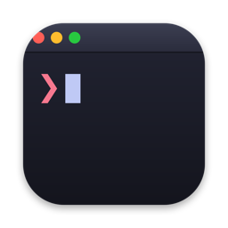
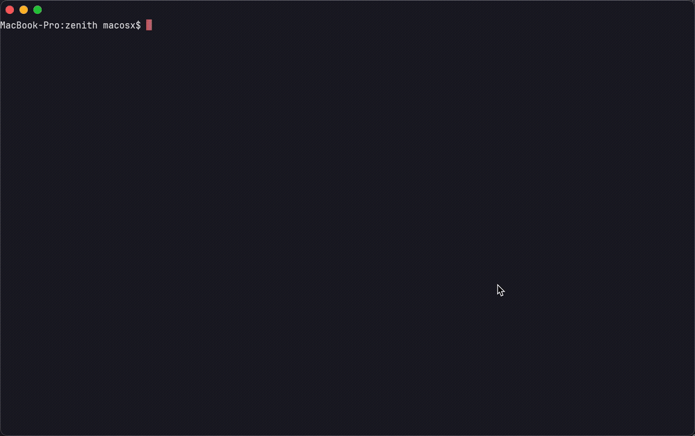

<div align="center">



# Zenith

**A GPU-accelerated terminal emulator for macOS, built with Rust and Metal.**

[](https://github.com/Gkyohd/zenith/releases)
[](crates/)
[](Zenith/)
[](LICENSE)
[](https://x.com/qqqtelegram)

**English** · [简体中文](README.zh-CN.md)

*Fast where it matters. Quiet where it counts.*



</div>

---

## Features

| | |
|---|---|
| ⚡ **Metal rendering** | Instanced GPU rendering of glyphs and backgrounds; on-demand redraw keeps CPU idle when the screen is static |
| 👻 **Ghost-text autosuggest** | Inline suggestions from your command history, ranked by frequency + recency. Accept with `→` or `Tab` |
| 🤖 **AI panel** | `⌘K` opens an inline AI assistant powered by Claude |
| 🗂 **Native windows & tabs** | Cascading windows (`⌘N`) and native macOS tabs (`⌘T`), each with an independent shell session |
| 🔎 **Shell integration** | OSC 133 markers track prompts and commands for smarter features on top of a plain shell |
| 🖥 **Full-screen apps done right** | Proper alt-screen handling for `vim`, `less`, `btop` & co. — cursor, colors, and scrollback survive the round trip |
| 🔠 **Live font scaling** | `⌘+` / `⌘-` / `⌘0` without restarting the session |

## Install

Grab the latest `.dmg` from [Releases](https://github.com/Gkyohd/zenith/releases), drag **Zenith** into `/Applications`.

Or build from source:

```bash
git clone https://github.com/Gkyohd/zenith.git
cd zenith
make install   # builds release binaries, bundles Zenith.app, installs to /Applications
```

**Requirements:** macOS 13+, Rust toolchain, Xcode Command Line Tools.

## Keyboard shortcuts

| Shortcut | Action |
|---|---|
| `⌘N` / `⌘T` | New window / new tab |
| `⌘K` | Toggle AI panel |
| `→` or `Tab` | Accept inline suggestion |
| `⌘+` `⌘-` `⌘0` | Adjust / reset font size |
| `⌘C` / `⌘V` / `⌘A` | Copy / paste / select all |
| `⌃⌘F` | Full screen |

## Architecture

```
┌──────────────────────────────────────────────┐
│  Zenith.app (Swift + AppKit)                 │
│  windows · tabs · input · IME · AI panel     │
├──────────────────────────────────────────────┤
│  Metal renderer                              │
│  instanced glyph/bg quads · glyph atlas      │
├────────────────── C FFI ─────────────────────┤
│  zenith-core (Rust)                          │
│  VTE parser · grid & scrollback · PTY        │
│  OSC 133 shell state · history frecency      │
└──────────────────────────────────────────────┘
```

- **`crates/zenith-core`** — terminal state machine: grid, scrollback, alt screen, shell integration, history
- **`crates/zenith-render`** — font rasterization, glyph atlas, GPU instance generation
- **`crates/zenith-ffi`** — C ABI surface consumed by Swift
- **`Zenith/`** — SwiftPM app: AppKit shell, Metal pipeline, NSTextInputClient (full IME support)

## Development

```bash
make build     # debug build (Rust + Swift)
make check     # cargo test + clippy
make app       # release .app bundle in dist/
make dmg       # distributable disk image
```

## License

[MIT](LICENSE)
